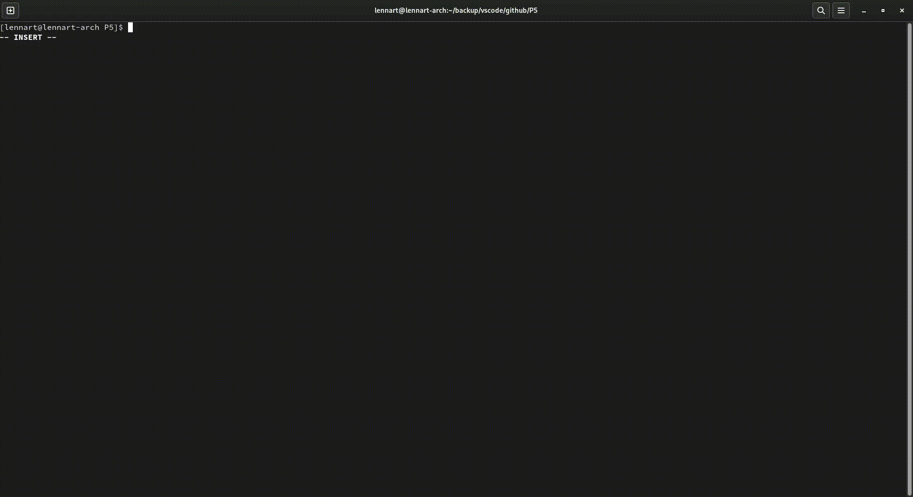
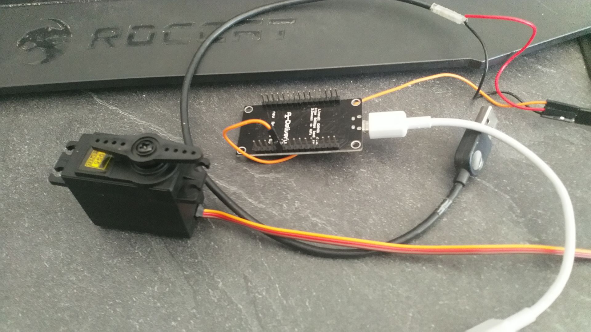

# P5 - "Tür der fetten Dame"

Dies ist eine Projektausarbeitung zum Bauen einer Sprachgesteuerten, automatischen Tür.

## Vorwort

Dieses Dokument enthält in jeder Form Dokumentation & Reflexion
Sie ist in verschiedenen Versionen erhältlich:

- [Online](https://github.com/Horkrux8/P5)
Dies ist die empfohlene Variante, der Code ist dort zugänglich, dieses Dokument ist auf der Seite direkt sichtbar, hat ein Inhaltsverzeichnis und die Links funktionieren. (Eine Mathematische Funktion wird dort evtl. nicht korrekt dargestellt.)

Von den folgenden Versionen rate ich ab aufgrund vielen mangelnden Funktionen:

1. Papier
- Keine Links
- Kein Inhaltsverzeichnis
- Fehlerhafte Codeblöcke
- Fehlerhafte Formatierung
Diese Version wird als Abgabe in einer Mappe vorliegen.

2. README.html
- Einige Fehlerhafte Links
- Kein Inhaltsverzeichnis (bei falscher Software)
Diese Datei liegt im abgegeben Zip-Archiv/READMEs vor.

3. README.docx
- Benötigt Software
- Fehlerhafte Formatierung
- Kein Inhaltsverzeichnis
- Fehlerhafte Codeblöcke
Diese Datei liegt im abgegebenen Zip-Archiv/READMEs vor.

4. README.pdf
- Keine Links
- Fehlerhafte Codeblöcke
- Fehlerhafte Formatierung
Diese Datei liegt im abgegebenen Zip-Archiv/READMEs vor.


Die Dokumentation / Reflexion ist aufgeteilt in fünf Kategorien, welche zuerst alle Dokumentiert werden (Status zur Abgabe) und später reflektiert werden (Verlauf der Bearbeitung).

## Dokumentation der Arbeitspakete

### Material Beschaffung

### Öffnungsmechanismus

### Software / Hardware

Die technische Umsetzung der Tür erfolgt mit zwei Geräten, einem Host (Laptop) und einem Client (Mikrocontroller / esp8266).
Der Host startet das Programm und dies nimmt auf was gesagt wird, wenn es das gesuchte Wort erkennt, wird der Client über das USB Kable benachrichtigt.
Der Client durchsucht dann die empfangene Nachricht nach der Servo Konfiguration und stellt den Servo ein.

#### Vorwort - Codeblöcke

*Die Codeblöcke der Dokumentation sind keine vollständige Repräsentation der fertigen Applikation, sondern dienen als der Erklärung dieser.*

---

- Im folgenden Text wird des Öfteren `in-Zeilen-Code` referiert (Dieser ist in den Blöcken wiederzufinden).
- ##### Funktionen: `Funktions-Namen()` in Überschriften

- Codeblöcke mit einer Generellen Beschreibung darüber:

Dieser Codeblock dient als Beispiel zur Veranschaulichung der Formatierung.
```python
# von Datei-Namen: Funktions-Namen(), Conditional-Statement
print("Ein Code Beispiel") # Mit Kommentar
```
- Und einer detaillierteren Benennung des Ablaufs darunter:

Die erste Zeile beschreibt die Position, dies hat meist ein `#` oder `//` davor, dies Kennzeichnet Kommentare.

#### Genaueres - [talking.py](talking.py)

Dies ist das Host Programm, welches für Spracherkennung, Tonausgabe und Kommunikation mit dem Client verantwortlich ist.

##### Funktion: `record()`

Diese Funktion ist für Tonaufnahmen und Spracherkennung zuständig.

Hier nutze ich die Library: "SpeechRecognition" (Im code: `recognizer.xyz()` & `microphone.xyz()`)
```python
# von talking.py: record()
with microphone as source: recognizer.adjust_for_ambient_noise(source) # Take ambient noise into account
    while True:
        print("Now Ready, listening in %s. (Press Ctrl+c to or say exit/quit/stop to quit)" % c.language_val)
        with microphone as source: audio = recognizer.listen(source)
        print("found audio sample")
```
Das Programm stellt sich am Anfang auf Störgeräusche ein und speichert eine Tonaufnahme in `audio`.

Diese Aufnahme wird an eine Google API geschickt, welche dann den erkannten Satz zurückgibt.
```python
# von talking.py: record()
value = recognizer.recognize_google(audio, language=language_val)
```
Danach wird `value` "decoded", also in normale Schrift umgewandelt und weitergegeben.

<h5 id="funktionen-send-receive">
Funktionen: <code>send(Send_string)</code> & <code>receive(Search_string)</code>
</h5>

Diese Funktion ist der Sende Teil der Seriellen Kommunikation (**U**niversal-***S**erial*-**B**us)

Hier nutze ich die Library: "pyserial" 
Im code:
`serial.Serial(port, Geschwindigkeit, timeout).xyz()`
oder auch:
`ser.xyz()`

Anfangs konfiguriert das Programm die Schnittstelle mit den Werten aus [config.py](config.py).

```python
# von talking.py
port, baud = [value for value in list(c.serialcom.values())]
ser = serial.Serial(port, baud, timeout=1)
ser.flush()
```

Die Sende Funktion schickt einfach den gegeben Wert `Send_string` mit einem Token zum Identifizieren auf die geteilte Serielle Schnittstelle.

```python 
# von talking.py: send(Send_string)
ser.write((c.HostKey+str(Send_string)).encode())
    print("HOST Send: %s %s" % c.HostKey, Send_string)
```

Die Empfangen Funktion stoppt das Programm so lange bis es auf der Schnittstelle den gegebenen Wert: `Search_string` in den allen empfangenen Nachrichten: `data` findet.
(`Search_string` ist in späterer Anwendung immer der Identifizier Token des Clients)
```python
# von talking.py: receive(Search_string)
while True:
        if ser.in_waiting > 0:
            data = ser.readline().decode('utf-8').rstrip()
            print("HOST Received: %s" % data)
            if Search_string in data:
                print("HOST found: %s" % Search_string)
                return data
```

Die Funktion gibt auch die Empfangenen Daten weiter<sup>1</sup>, sollten diese den `Search_string` enthalten.

---
<sup>[1]: In meiner Anwendung überflüssig, es wird nur für Debug nutzen ausgegeben.

##### Funktion: `play(play_string)`

Diese Funktion ist für das Abspielen von vorhandenen oder Computer generierten Tonaufnahmen verantwortlich.

Hier nutze ich die Library: "os" (Im code: `c.os.xyz()`)
Sie wird zur Systemunterscheidung von Windows & Linux, und zum Ausführen von Befehlen genutzt.


Hier durchsucht das Programm eine vordefinierte Liste an Tonaufnahmen in ./audio (Definiert in [config.py](config.py)) nach dem `play_string`.
Sollte es ein Eintrag geben, wird diese Tonaufnahme abgespielt.
```python
# von talking.py: play(play_string)
if play_string in c.audio_dict.keys():
        # Play one of the audios defined in config
        print("Found existing audio")
        # c.os because im recycling the import from config (c)
        c.os.system("mpg123 -q " + c.audio_dict[play_string]) 
```

Alternativ nutzt das Programm die Library: "**g**oogle-**T**ext-**T**o-**S**peech"
Im code:
`gTTS("xyz", "de").xyz()`
oder:
`tts.xyz()`.
Hier schicken wir an Google, was wir gerne gesagt haben wollen (`play_string`), und Google schickt eine Computer-generierte Tonaufnahme zurück, diese wird dann gespeichert, abgespielt und gelöscht.
```python
# von talking.py: play(play_string)
else:
        # Create new audio by Google
        print("Creating temporary audio")
        file = play_string+".mp3"
        tts = gTTS(play_string, c.language_val[0:2]) # Take first two char from language_val (de)_DE
        tts.save(file)
        # Play audio using command line player
        c.os.system("mpg123 -q " + file)
        c.os.system("rm " + file)
```

##### Funktion: `main()`
Diese Funktion verknüpft alles zusammen in einer geordneten Ablaufstruktur. Sie wird am Ende aufgerufen.

```python
# von talking.py: main()
print("running in mode = %s" % runmode)
while True: # Keep running even on false reply
    # Decide runmode (mostly for debug or should anything not work during presentations)
    if runmode == 1:
        recstring = record() 
    elif runmode == 2:
        recstring = c.magic
    elif runmode == 3:
        configureServo()
```
Hier gibt wird der Verlauf entschieden:
1. Normal, Aufnehmen -> Servo verstellen.
2. Spracherkennung Fail safe, Servo verstellen.
3. Konfiguration, Servo je nach Nutzer Eingabe verstellen.

Nun wird entschieden, ob das Wort in `recstring` den unser Gewünschtes Wort in `c.magic` ist.
```python
# von talking.py: main(), while True
if recstring.lower() == c.magic.lower():
    print("Magic word recognized = %s" % c.magic)
    send("180") # actually 90 for the big Servo
    break
```
Wenn dies der Fall ist, nutzen die vorher erwähnte `send(Send_string)` Funktion, welche darauf den Identifizier Token mit 180 an den Client schicken wird.
Wie der Client die Nachricht versteht, wird im nächsten Kapitel ([opendoor.ino](opendoor.ino)) erläutert.

Zuletzt wird noch alles an die Konsole weitergegeben was auf der Seriellen Schnittstelle ankommt. Sollte der Client Identifizier Token dabei sein, wird das Programm beendet. (Siehe Funktion [receive()](#funktionen-send-receive))
```python
# von talking.py: main(), while True
receive(c.ClientKey) # Read esp serial debug
ser.close()
```

<h4 id="genaueres-opendoor.ino">
Genaueres - <a href="opendoor.ino">opendoor.ino</a>
</h4>

Dies ist das Client Programm, welches für die Steuerung des Servos und Kommunikation mit dem Host zuständig ist.

Hier nutzen wir `Servo.h`, eine Library (Im code: `Servo.xyz` oder auch `door.xyz()`)

Am Anfang werden Setup Werte konfiguriert:
```cpp
// von opendoor.ino
#define StartDegree 0 // Start from on power reset
#define PIN 4 // 4 is D2
#define baudrate 9600 // Communication speed
```
- Der `StartDegree` gibt die Servo Rotation im geschlossenen Zustand an.
- Der `PIN` ist der **P**ulse-**w**idth-**m**odulation Pin, er transferiert Daten zwischen dem Client und dem Servomotor.
- Die `baudrate` ist die Kommunikationsgeschwindigkeit der Seriellen Schnittstelle, diese muss für Host & Client identisch sein.

In der `setup()` Funktion aktivieren wir alle nötigen Libraries, die Serielle Schnittstelle und setzen den Servo auf seine Startposition.
```cpp
// von opendoor.ino: setup()
door.attach(PIN); // This is pin D3
Serial.begin(baudrate);
Serial.printf("\nCLIENT: Started \n");
door.write(StartDegree); // Reset servo
```

Nach dem Setup geht der Client in die `loop()` Funktion und wiederholt diese für immer.
```cpp
// von opendoor.ino: loop()
if (Serial.available() > 0){
        // Read all incoming
        incomingString = Serial.readString();
        Serial.print("CLIENT: Found incoming serial: "+incomingString+"\n");
```
Hier wartet der Client bis auf der Seriellen Schnittstelle Nachrichten kommen, diese werden in `incomingString` gespeichert.

```cpp
// von opendoor.ino: loop(), if (Serial.available() > 0)
if (incomingString.indexOf(HostKey) == 0){
            // If incomingString starts with HostKey, strip HostKey of incoming to find target & change rate
            int targetDegree = incomingString.substring(HostKey.length()).toInt();
            int changeDegree = 4; // Degree to continue in one turn
            int changeDelay = 10; // Delay in ms between turns
            int currDegree = door.read();
            int overflowDegree = (currDegree - targetDegree) % changeDegree;
            changeDegree = (currDegree > targetDegree) ? changeDegree*-1 : changeDegree*1; // Negate direction
```
Sollte die Nachricht den Host Identifizier Token enthalten wird dieser abgeschnitten und der Rest in `targetDegree` gespeichert (Servo Zielposition).
Außerdem wird festgelegt in welchen Schritten, in welchen Zeitabständen und in welche Richtung sich der Servo dreht, wobei letzteres automatisch passiert.

Da nicht jede Ziel Position in jeder Schrittgröße von jeder Start Position erreichbar ist, wird hier der Rest der Division von der Differenz von Start-Ziel Positionen durch die Schrittgröße genommen und zu der derzeitigen Position zugerechnet.
```math
overflowDegree =(DerzeitigePos-ZielPos) \bmod Schrittgröße \\
(30-80)\bmod 4 = 2
```
Bei dem Versuch sich von 30° nach 80° mit einer Schrittgröße von 4 zu rotieren, würde darin Enden, dass der Motor sich auf eine falsche oder sogar nicht vorhandene Position dreht (-2°), was Probleme verursacht.

Also passt das Programm die derzeitige Position so an, dass diese Restlos mit der Schrittgröße Teilbar ist.
```cpp
// von opendoor.ino: loop() if (Serial.available() > 0) -> if (incomingString.indexOf(HostKey) == 0)
if (overflowDegree != 0){
                door.write(currDegree + overflowDegree);
                Serial.printf("Adjusting to step size: %d, starting from %d\n", changeDegree, currDegree - overflowDegree);
                currDegree = currDegree + overflowDegree;
            }
```
Nun ist die Ziel Position von der Start Position erreichbar und es kann gedreht werden, dies passiert in der folgenden Schleife:
```cpp
// von opendoor.ino: loop() if (Serial.available() > 0) -> if (incomingString.indexOf(HostKey) == 0)
// Slow down rotation by rotating +changeDegree° every changeDelay ms
for (currDegree; currDegree!=targetDegree; currDegree += changeDegree) {
    Serial.printf("CLIENT: Turning to: %d, target: %d, step size: %d \n", currDegree, targetDegree, changeDegree);
    door.write(currDegree);
    delay(changeDelay);
    }
```
Die Schleife läuft so lange die derzeitige- von der Ziel- Position abweicht,
bei jedem Durchlauf wird der Wert der derzeitigen Position (`currDegree`) um die Schrittgröße (`changeDegree`) inkrementiert und der Servomotor zu dem gesteigerten Wert gedreht.



Bei der Beendung des Programms wird sichergestellt das der Servo auch wirklich an der gewünschten Position ist und es wird eine Nachricht an den Host geschickt, dass dieser aufhören soll, Debug Nachrichten auf die Konsole ausgeben soll und sich selbst beendet.
```cpp
// von opendoor.ino: loop()
door.write(targetDegree); // Close any remaining gap to target
Serial.printf("CLIENT: done (at: %d) \n", door.read());
Serial.println(ClientKey);
// Everything beyond ClientKey wont be read by Host
```

### Qualitätsprüfung

## Reflexion der Arbeitspakete

### Materialbeschaffung

### Öffnungsmechanismus

Die Planung des Öffnungsmechanismus für unser P5 Projekt hat mit einer Recherchephase begonnen. Ich hatte mir Öffnungsmechanismen für Türen angeschaut, in einem Dokument gesammelt und mit eignenden Ideen vervollständigt. 
Anschließend habe ich die Mechanismen auf Funktionalität und Umsetzbarkeit in unserem Modell geprüft. Im Wesentlichen haben sich 2 infrage kommende Öffnungsmechanismen gebildet.

#### Ein-Schienen Mechanismus

Bei dieser Konstruktion wird der Servomotor wird oberhalb der Tür befestigt, und bewegt nach unten gehend einen Metallrotor um etwa 90 grad. Der Rotor ist durch eine Metallschiene oben an der Tür befestigt. 


Dies hat den Vorteil das es im Vergleich zum [Zwei-Schienen Mechanismus](#zwei-schienen-mechanismus) simple zum Konstruieren ist. 

#### Zwei-Schienen Mechanismus

Der Zwei-Schienen Mechanismus übersetzt eine Drehung von 180 grad in eine Öffnung von 90 grad.


Dies bringt den Vorteil dass der Motor mit Doppelter Kraft agieren kann, ist aber wesentlich komplexer.


### Software / Hardware

Die Umsetzung ließ sich in einfachere Unterprobleme gruppieren:
- Spracherkennung
- Sprachausgabe
- Tür Öffnung

Da ein Mikrocontroller zur Ansteuerung des Motors sowieso benötigt wurde (mehr in [Tür Öffnung](#tür-öffnung))
stand fest das ich ein separates Gerät zur Sprach- Erkennung/Ausgabe nutze.
Schlussendlich brauchte ich ein Programm zur Kommunikation zwischen Computer<->Mikrocontroller.

Das Vorwissen für eine solche Kommunikationsbrücke hatte ich bereits seit einer Wetterstation-Klausurleistung.
Schlussendlich brauchte ich ein Programm zur Kommunikation zwischen Computer<->Mikrocontroller um den Motor anzusteuern.

Das Vorwissen für eine solche Kommunikationsbrücke hatte ich bereits seit einer Wetterstation-Klausurleistung.
#### Spracherkennung

Anfangs hatte ich mir eine Software zur Spracherkennung rausgesucht, diese war aber eher als Home-Automation gedacht, also ein Programm zu Ausführung von simplen Befehlen bei Erkennung eines Wortes. Es wurde schnell klar, dass der Begriff "Software" nicht beschreibt was ich suchte.

Kurz danach fand ich die Code-Library [SpeechRecognition](https://pypi.org/project/SpeechRecognition/), diese integrierte ich dann in das Programm der Kommunikationsbrücke.
#### Sprachausgabe

Die Sprachausgabe war eine Idee, welche im Verlauf des Projekts aufkam, die Tür sollte nicht nur bei dem Passwort aufgehen, sondern auch selber Kommentare machen können.

Nach der Erfahrung in [Spracherkennung](#spracherkennung) suchte ich nach einer ähnliche Library die ich schnell fand.
Auch in [gTTS](https://pypi.org/project/gTTs/) schicken wir einen Text an Google und kriegen eine Audiodatei zurück.

Allerdings nutzen wir nur vorgefertigte Audiodateien.

#### Tür Öffnung 

Zur Öffnung der Tür benötigten wir einen Motor, es gab mehrere Arten welche zur Auswahl standen:
- Plain-Elektromotor
- Stepper-Motor
- Servo-Motor

Ein einfacher Elektromotor dreht sich Kontinuierlich und benötigt ein zusätzliches Modul zum Rückwarstdrehen (Umdrehen der Spannung).

Ein Stepper-Motor dreht sich in Schrittgrößen, also z.B. 200 Zähne (Am Zahnrad) vorwärts, allerdings hat dieser eine geringer Zugkraft und drehte sich nicht Rückwärts.

Ein Servo erschien sehr schnell als nützlichste Art aufgrund der absolut-Grad-basierten Drehung und der hohen Zugkraft.
Ursprünglich war die Drehung des Servo-Motors sehr abrupt.


Dies war zu schnell für unsere Anwendung, glücklicherweise ließ sich dies mit einer [Schleife](#genaueres-opendoor.ino) lösen.

Wir zweifelten an der Kraft des Servos, dieser hatte eine Kraft von $2,5kg/cm$
Dieser funktionierte mäßig während eines Testlaufs in der Werkstatt:

[](video/tür_testlauf.mp4)

Nach dem Fehlschlag während der 2. Konsultationssitzung sind wir auf einen größeren Servo umgestiegen, dieser unterstützt $10kg/cm$



Dieser hatte bei weiter mehr Kraft und erfüllte unsere Anforderungen:


### Qualitätsprüfung